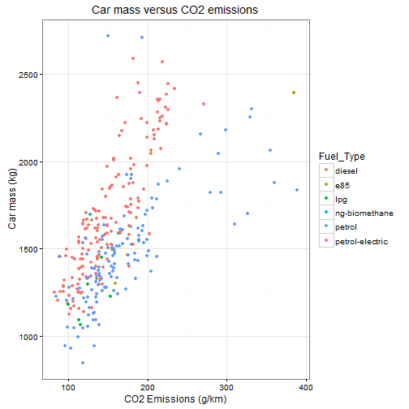

EU Cars CO2 emissions Visualization Tool
===================================

## Author: fpmcardoso
## Date: December 2015

Introduction
========================================================

This presentation will introduce the EU cars CO2 emissions Visualization Tool webapp 
that was a Course Project for the Developing Data Products class of 
the Johns Hopkins University, hosted by Coursera.

Start by accessing the app:

- [Live version](https://cardosof.shinyapps.io/ddpproject) on ShinyApps

This simple application can run in any modern browser. 
Mobile devices are technically supported, hovewer, due to the nature of the charts, the
app might not be that useful on small screens.

The source code and the data can be found on [GitHub](https://github.com/fpmcardoso/data-products)

Available data & Objectives
========================================================

This Visualization Tool is a simple webapp that displays some properties of 
the car datasets from the [European Environment Agency](http://www.eea.europa.eu/data-and-maps/data/co2-cars-emission-9). 

Regulatory policies require EU Member States to record information for each new passenger car registered in its territory. The data is released, then, as CSV files. In the EEA website there is [a visualization tool](http://www.eea.europa.eu/data-and-maps/daviz/cars-co2-emissions-trends-by-manufacturer-2) to compare car manufacturers.

With this context in mind, this project aims at:

1. Summarizing the EEA datasets
2. Visualizing the data in new ways & finding possible outliers and relationships
3. Making the data easily searchable

What the Tool does
========================================================

Users can:
- Search the raw data
- Filter data by CO2 emission level, country, year and manufacturer
- Visualize the data from different perspectives (by country and by manufacturer)
- Visualize car mass vs emission level and see average emissions over the years

***
 
*Ex: ggplot2 visualization with sample data - code is within this markdown*

Implementation details & tips
========================================================

- This tool uses standard ShinyApp features, using `Navbar`s and several `tabPanel`s
- Sample data is loaded from a local CSV which was created with the `data_extraction.R` script in the source code. 
- Interactive charts are displayed using the `rCharts` package
- This presentation was created by using RStudio's R presenter (.Rpres)
- Due to dataset size limitatons in the free version of ShinyApps.io, the app is currently working with a small subset
- Try filtering for your favorite cars and see how they compare to others :)
